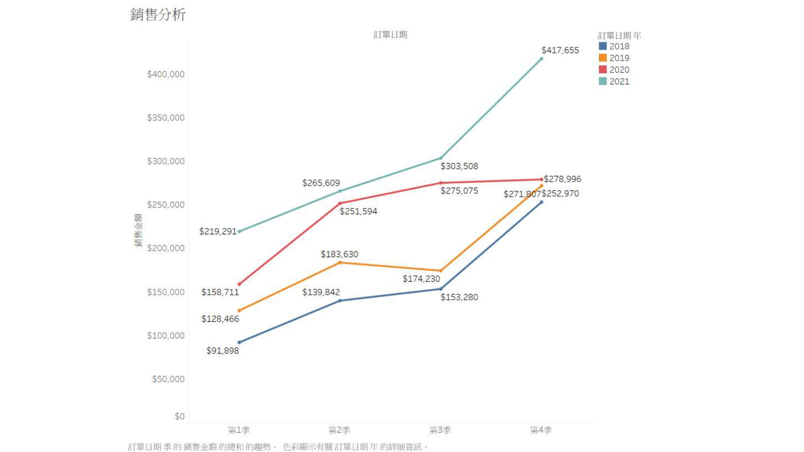
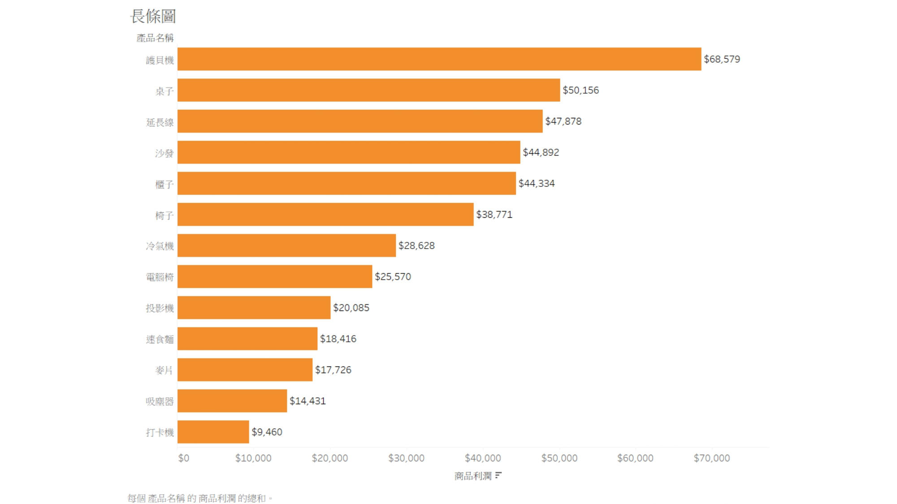
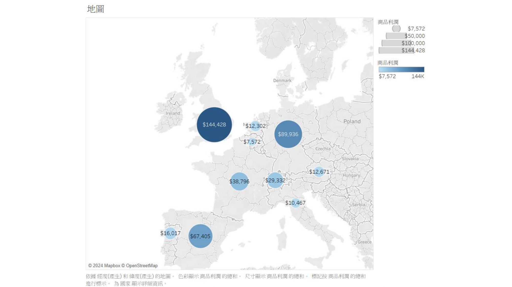

# 銷售數據分析專案 (Sales Data Analysis Project)

## 專案概述

這個專案對銷售數據進行全面分析，從多個角度探索業務績效。通過對訂單處理、銷售金額、利潤率、產品表現、時間趨勢和客戶行為的深入分析，為業務決策提供數據支持。

分析目的在回答以下關鍵問題：
- 訂單處理效率如何？
- 哪些產品貢獻最高利潤？
- 銷售有什麼季節性趨勢？
- 客戶消費模式如何？
- 各區域市場表現如何？

## 數據集描述

分析包含銷售交易的綜合數據集：
- 總訂單量：10,933 筆交易
- 時間範圍：2018-2021年
- 主要維度：訂單、產品、客戶、地區、時間
- 關鍵指標：銷售金額、商品利潤、處理時間

## Data Source

-數據來源參考：
- [Tableau 商業智能儀表板範例](https://www.youtube.com/watch?v=p4pqSTANWRo) - 此視頻提供了視覺化範例，啟發了本專案的分析方向

## 分析方法

本專案使用Python進行數據處理和分析，主要使用pandas進行數據操作和轉換。分析流程包括：

1. **數據讀取與預處理**：處理日期格式，確保數據一致性
2. **多維度分析**：從不同角度切入，探索各種業務指標
3. **時間序列分析**：觀察銷售趨勢和季節性模式
4. **客戶與產品細分**：深入了解產品績效和客戶行為

### 主要分析函式

專案包含以下分析函式：

- `order_processing_analysis`: 訂單處理效率分析
- `order_amount_analysis`: 訂單金額分佈分析
- `profit_margin_analysis`: 利潤率和盈利能力分析
- `product_analysis`: 產品銷售和利潤分析
- `time_series_analysis`: 銷售時間趨勢分析
- `customer_analysis`: 客戶行為和購買模式分析

## 關鍵發現

### 銷售趨勢
- 2018年至2021年間銷售持續增長，尤其在第四季度表現強勁
- 利潤增長率達到13.8%，顯示良好的盈利能力提升

### 產品績效
- 家電類別是利潤最高的產品（尤其是複印機和桌子）
- 傢俱類別佔總銷售的47.76%，是最大收入來源

### 客戶洞察
- Westside客戶貢獻最高銷售額($858,353)
- 高頻客戶雖然數量較少，但貢獻了顯著的收入份額

### 地區表現
- 英國市場利潤最高($144,428)，顯示強勁的市場地位
- 西歐地區整體表現優於其他地區

## 商業建議

1. **供應鏈優化**：提高訂單處理效率，尤其是針對高價值訂單
2. **產品策略**：加大對高利潤率產品的行銷投入
3. **季節性促銷**：根據銷售旺季制定有針對性的促銷策略
4. **客戶關係管理**：開發高頻客戶忠誠度計劃
5. **區域擴展**：強化表現良好的地區，同時探索新興市場機會

## 技術實現

專案使用Python實現，主要依賴以下：
- pandas: 數據處理和分析
- tableau: 可視化支持

## 數據可視化亮點

專案生成多種可視化圖表以展示分析結果：

### 銷售趨勢分析
  
*圖1: 2018-2021年度各季度的銷售金額趨勢，展示了明顯的季節性模式和整體成長趨勢。*

### 產品利潤分析
  
*圖2: 利潤最高的產品類別，複印機、桌子和延長線位列前三。*

### 地區銷售分析
  
*圖3: 歐洲地區的銷售分佈，英國市場貢獻最高利潤。*

## 未來擴展

- 整合機器學習模型進行銷售預測
- 深入挖掘客戶生命週期價值
- 構建實時分析儀表板

## 使用說明

運行主分析腳本：

```python
from sales_analysis import generate_report

# 執行完整分析（使用默認數據文件'Data.csv'）
results = generate_report()

# 或者指定數據文件
# results = generate_report('your_custom_data.csv')

# 獲取特定分析結果
profit_data = results['profit']
top_products = results['top_products']
```

